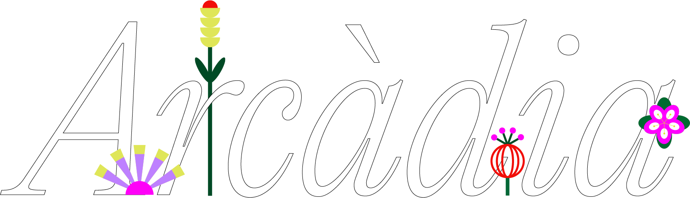

# ARCÀDIA

## 1. [PROJECT IDEA](#project-idea)

### a. Theme

### b. Aim / goal

### c. Concept

### d. Context of use

## 2. [STRUCTURE](#structure)

## 3. [CODE](#code)

### a. Face recognition

### b. Generative art + palette

### c. Challenges

### d. References

## 4. [TEAM](#2-team)

Alexandra Chiojdeanu, Greta Cozza, Anna Gargantini, Matteo Ligori, Eva Parenti

# PROJECT IDEA

**THEME**
The project is inspired by one of VISAP 2020 ‘s themes, the enchantment.
Whe choose it because it is a really broad topic that leaves space for many different interpretation since it could mean everything: it could be scaled down to the ordinary experience of everyday life, as well as brought to an “higher” more conceptual, poetic level.

**AIM**
This project aims to allow the user to carve out a moment of recollection in which they can let their feelings flourish by dedicating them to someone.

**CONCEPT**
Arcàdia is a place of shelter, a place to live and sing love, even disappointed love.It’s a meditative moment that allows thoughts to flow and feelings to express themselves.Arcàdia is the space where words are free to exist.

**CONTEXT OF USE**
Arcadia is designed to be experienced in the comfort and tranquillity of your home's pc, where noone can hear or disturb you. However, with some adjustement (like for exemple a sound-insulated installation where the user is alone) the experience could be readapted to a exhibition context.

# STRUCTURE

The project is composed by multiple HTML pages. The experience can be divided in three main part: a landing page, an homepage and the actual flower creation experience.

1. As soon as the user access the website, the user find a gate that, once opened, will lead them first to the title page and then to the homepage.
2. The homepage is an horizontal scroll garden containing a serie of flowers.
   This page is both the starting point for the flower creation experience (that the users can access by clicking on an looping text on the top of the page) and the place where all flowers are planted once a flower has been created by a user.
3. The actual flower creation experience is based on voice recognition and it is divided in two steps:

- At first the user needs to say out loud who their message is dedicated to. This information will be saved and appeard in the homepage at a mouse hover.
- Then, the user can leave their message: according to some parameters (volume, pitch and lenght of the message) a flower grows and changes its appearence, ensuring a unique result.

# CODE

**VOICE RECOGNITION**
The biggest challenged we faced has been the voice detection and recognition. As described before the unique feature of the flower (its size, its number of petals, and the height of its stem are determined by the volume, the pitch of the user’s voice and the length of the message).
In order to avoid that the final result would only represent the volume detected the moment just before the user decide to stop the recording, this parameter is added to a fantino that return its average. As a result, the flower’s size change much more faster at the beginning while it tend to stabilise itself as the message is recorded.
While the Volume is calculated with the simple function Get Amplitude(), the pitch detection required more steps: we use the function GetEnergy to detect the maximum volume of a small set of amplitude ranges, in order to discover which one prevailed.
Both volume and pitch values has been remapped according to the “type” of flower that was assigned randomly to the user as they accessed the website.

**FIREBASE**
Another important feature of our project is the use of a database to create a collection of all the flowers generated by the users.
After the name of the addressee is told and the flower is created by the user, the "plant it" button activates a function that.
Archives all the important data that are required for the creation of the flower in a firebase realtime database.
First off the volume, the frequency and the time value of the message, but also the name of the person and some random values, that generated at each acces, determines the shape of the flower, his colour
and the position of the leaves on the stem.
Once all the data has been archived the flowers are redrawed in the homepage garden.
Here if the user hovers with the mouse on the flowers they can visualize the name of the addressee of the flower

# TEAM
